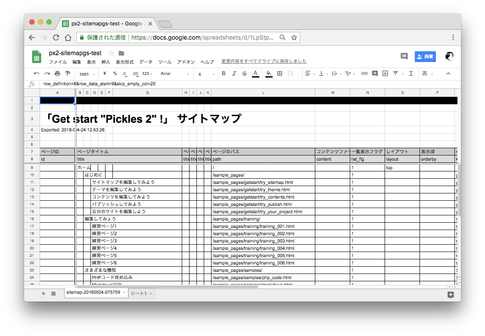

# tomk79/px2-sitemapgs
Pickles2 に、サイトマップを Google スプレッドシート で編集できる機能を追加します。



本来の Pickles 2 のサイトマップは、CSV形式で記述されます。 CSVはもっとも単純で基本的なデータ形式の1つで、コンピューターが処理するには扱いやすいフォーマットですが、人間が編集するには不便なこともありました。
このプラグインを導入すると、Google スプレッドシートと連携し、より直感的でグラフィカルに編集することができるようになります。

- Googleスプレッドシート上で編集されたサイトマップを直接読み込むことができるようになります。
  - アクセス時、定期的に自動的に読み込まれます。 `csv_expire` オプションで、更新間隔を秒単位で設定できます。
  - PXコマンド `?PX=sitemapgs.gs2csv` を使って、手動で更新することもできます。
  - PXコマンド `?PX=sitemapgs.csv2gs` を使って、現在のサイトマップCSVの内容を Googleスプレッドシートに出力できます。(日付つきの新しいシートを作成して出力します。このシートを実際に使用するには、シート名を `sitemap` に変更してください)
- ページの階層構造(`logical_path`)を、視覚的な階層構造で表現できます。
- Googleスプレッドシートの 色付きセル や テキスト装飾 などの編集機能を使い、美しい表をアレンジできます。
- Googleスプレッドシート の `A1` のセルに、サイトマップの設定が記述されています。
  - 設定例 :  `row_definition=8&row_data_start=9&skip_empty_col=20`
  - *row_definition* : 定義行番号
  - *row_data_start* : データ行の開始行番号
  - *skip_empty_col* : 定義行に値のない列がある場合、その先を読み込む列数
- `A` 列に、文字列 `EndOfData` を見つけたら、それより下の行はスキャンされません。コメント欄を追加したり、ページ数のカウンターを設置するなど、自由に使えます。
- 拡張カラム `**delete_flg` に `1` をセットすると、CSVに出力されなくなります。
- シート名 `sitemap` の内容を使用します。その他のシートは読み取りません。


## 事前準備

このプラグインからGoogleスプレッドシートにアクセスするために必要な事前準備について説明します。

### Google Developers Console での操作

1. [Google Developers Console](https://console.developers.google.com/) にログインして、プロジェクトを作成します。
2. 作成したプロジェクトの "認証情報" メニューから、 "認証情報を作成" で  を作成します。 
	- "サービスアカウントキー" を選択します。
	- "サービスアカウント" で "新しいサービスアカウント" を選択します。
		- 任意のサービスアカウント名を入力します。 (このアカウント名は、後に Googleスプレッドシートの共有先として使用されるメールアドレスになります)
		- 役割で "Project > 閲覧者" を選択します。
	- キーのタイプ で "JSON" を選択します。
	- "保存" ボタンをクリックすると、JSONファイルのダウンロードが始まるので、保存します。 (ここでは、 `service-account.json` という名前をつけて保存することにします。以降この名前で説明します)
3. "Google Sheets API" を有効にします。
	- "ダッシュボード" へ戻り、 "APIとサービスの有効化" を選択します。
	- たくさんあるAPIの中から、 "Google Sheets API" を探して、クリックします。
	- "Google Sheets API" のページにある "有効にする" ボタンをクリックします。

### Google Drive での操作

1. [Google Drive](https://drive.google.com/) にログインして、 Googleスプレッドシートを作成します。
2. Googleスプレッドシートの共有設定を開き、 Google Developers Console で作成した サービスアカウント に対して共有します。
	- `service-account.json` に含まれる `client_email` にあるメールアドレスに共有します。
	- 編集権限を付与します。

`service-account.json` と、 Google スプレッドシート のIDを控えます。
この情報は後にプラグインオプションなどに使用します。

スプレッドシートのURL `https://docs.google.com/spreadsheets/d/xxxxxxxx/edit#gid=0` のうち、 `xxxxxxxx` の部分がスプレッドシートのIDです。


## インストール - Install

### 1. `composer.json` に `tomk79/px2-sitemapgs` を追加

require の項目に、"tomk79/px2-sitemapgs" を追加します。

```json
{
	"require": {
		"tomk79/px2-sitemapgs": "^0.0.1"
	},
}
```


追加したら、`composer update` を実行して変更を反映することを忘れずに。

```bash
$ composer update
```


### 2. `service-account.json` を配置

Google Developers Console で作成した `service-account.json` を配置します。
置き場所は、プロジェクトからアクセスできる場所ならどこでもよいです。 認証に用いるファイルなので、これ自体が誤ってパブリッシュされてしまわない場所を選んでください。 ここでは `./px-files/service-account.json` に配置することとして進めます。


### 3. `config.php` に、機能を追加

設定ファイル config.php (通常は `./px-files/config.php`) を編集します。
`before_sitemap` のどこか(例では最後)に、`tomk79\pickles2\sitemap_gs\main::exec` を追加します。

```php
// funcs: Before sitemap
$conf->funcs->before_sitemap = array(
	// PX=config
	'picklesFramework2\commands\config::register' ,

	// PX=phpinfo
	'picklesFramework2\commands\phpinfo::register' ,

	// PX=clearcache
	'picklesFramework2\commands\clearcache::register' ,

	// sitemapGs
	'tomk79\pickles2\sitemap_gs\main::exec('.json_encode(array(
		// `service-account.json` のパス
		'google_application_credentials' => './px-files/service-account.json',

		// CSVファイルの有効期限 (秒)
		// 60 と設定した場合、 CSVファイルのタイムスタンプから 60秒以上経過していたら、
		// Googleスプレッドシートから再読み込みします。
		// false を設定した場合、自然更新されなくなります。
		'csv_expire' => 60*5, // 5分ごとに再読み込み
	)).')',
);
```

Pickles 2 の設定をJSON形式で編集している方は、`config.json` の該当箇所に追加してください。

`service-account.json` の配置場所が異なる場合は `google_application_credentials` のパスを適宜修正してください。

すでに `pickles2/px2-sitemapexcel` (`tomk79\pickles2\sitemap_excel\pickles_sitemap_excel::exec`) が導入されている場合は、削除するか、同じファイルを操作しないように設定を変更してください。 設定方法については [pickles2/px2-sitemapexcel の README](https://github.com/pickles2/px2-sitemapexcel) を参照してください。


### 4. サイトマップディレクトリのパーミッション設定

macOS や Linux系 の OS ではこの操作が必要な場合があります。

```bash
$ cd {$documentRoot}
$ chmod -R 777 ./px-files/sitemaps
```

### 5. サイトマップディレクトリに `sitemap.gsheet` を設置

Pickles 2 のサイトマップフォルダ `px-files/sitemaps/` に、拡張子 `.gsheet` のファイルを作成します。 このファイル名は、`.csv` のファイル名と対応するように命名してください。 たとえば、 `sitemap.csv` に対応するファイル名は `sitemap.gsheet` になります。

`.gsheet` の内容は、次のような JSON ファイルです。 これは、 Google Drive のアプリ([バックアップと同期](https://www.google.com/intl/ja_ALL/drive/download/)) がローカルディスクとファイルを同期する際に作成されるファイルと同じです。 `tomk79/px2-sitemapgs` は、このうちの `doc_id` の値を参照します。

`xxxxxxx` の箇所に、スプレッドシートのID を記述してください。

```json
{
    "url": "https://docs.google.com/open?id=xxxxxxx",
    "doc_id": "xxxxxxx",
    "email": "hogefuga@example.com"
}
```

### 6. Google スプレッドシート上でサイトマップを初期化

ターミナル(Windowsではコマンドプロンプト)を開いて、次の PXコマンド を実行します。

```bash
$ php .px_execute.php "/?PX=sitemapgs.push"
```

このコマンドは、現在のサイトマップCSVの内容を Googleスプレッドシート に変換しアップロードします。
Googleスプレッドシート上に `sitemap-YYYYMMDD-HHiiss` という名前の新しいシートが作成されます。このシートが、意図したサイトマップ形式の内容になっていることを確認してください。


確認できたら、シート名を `sitemap` に変更します。 この操作によって、シートがアクティブになります。


## 使い方 - Usage

Googleスプレッドシート上のサイトマップからローカルのサイトマップCSVに取り込む手順は2通りあります。

1. ブラウザでプレビューしたことをトリガーに取り込めます。 前に更新されたCSVは プラグインオプション `csv_expire` に指定した秒数の間保持され、この期限が過ぎてからプレビューすると、CSVが更新されます。
2. PXコマンド `?PX=sitemapgs.pull` を実行して手動で取り込めます。この手順では、 `csv_expire` の期限の影響を受けず、強制的に取り込みます。


## PX Commands

- `?PX=sitemapgs.gs2csv`, `?PX=sitemapgs.pull` : Googleスプレッドシート のシート `sitemap` から CSV への変換を手動で実行します。
- `?PX=sitemapgs.csv2gs`, `?PX=sitemapgs.push` : CSV から Googleスプレッドシート への変換を手動で実行します。 日付が入った `sitemap-YYYYMMDD-HHiiss` という名前のシートが新規作成され、そこに出力されます。このシートを実際に使用するには、シート名を `sitemap` に変更してください。


## 関連リンク

- [Google Developers Console](https://console.developers.google.com/)
- [Google Sheets API Document](https://developers.google.com/sheets/api/reference/rest/)
- [google/google-api-php-client](https://github.com/google/google-api-php-client)


## 更新履歴 - Change log

### tomk79/px2-sitemapgs 0.0.1 (2018年5月3日)

- Initial Release.


## ライセンス - License

MIT License


## 作者 - Author

- Tomoya Koyanagi <tomk79@gmail.com>
- website: <http://www.pxt.jp/>
- Twitter: @tomk79 <http://twitter.com/tomk79/>


## 開発者向け情報 - for Developer

### テスト - Test

```
$ php ./vendor/phpunit/phpunit/phpunit
```

テストコマンドを実行する前に、次の準備をしてください。

- テスト実行に使用する `service-account.json` を、 `tests/testdata/data/service-account.json` に保存してください。
- `tests/testdata/data/sitemap.gsheet` に含まれる `doc_id` を テスト実行に使用する Googleスプレッドシート のIDで上書きしてください。
- テスト実行に使用する Googleスプレッドシート に、シート `sitemap` を作成してください。内容は空白のままにします。
